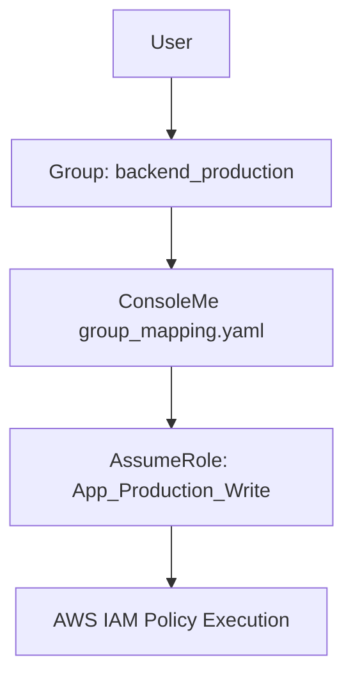
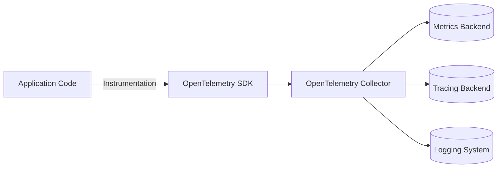

<!-- vscode-markdown-toc -->
* 1. [AWS ConsoleMe 권한 매핑 구조 이해](#AWSConsoleMe)
	* 1.1. [ConsoleMe의 역할](#ConsoleMe)
	* 1.2. [group_mapping 구조 분석](#group_mapping)
	* 1.3. [구조적 관계](#)
* 2. [스프링 @Transactional 어노테이션의 탄생 배경](#Transactional)
	* 2.1. [과거 EJB의 문제점](#EJB)
	* 2.2. [스프링의 혁신](#-1)
* 3. [@Transactional의 자바 생태계 영향](#Transactional-1)
	* 3.1. [엔터프라이즈 개발 패러다임의 전환](#-1)
	* 3.2. [철학적 의미](#-1)
* 4. [코드 기반 트랜잭션 관리 방식](#-1)
	* 4.1. [1️⃣ JDBC 직접 관리](#JDBC)
	* 4.2. [2️⃣ JPA `EntityTransaction`](#JPAEntityTransaction)
	* 4.3. [3️⃣ JTA `UserTransaction`](#JTAUserTransaction)
	* 4.4. [4️⃣ 스프링 프로그램적 관리 (`TransactionTemplate`)](#TransactionTemplate)
* 5. [OpenTelemetry의 목적과 구조](#OpenTelemetry)
	* 5.1. [등장 배경](#-1)
	* 5.2. [핵심 목표](#-1)
	* 5.3. [주요 구성 요소](#-1)
	* 5.4. [동작 구조](#-1)
	* 5.5. [개발자 관점 예시 (Spring Boot)](#SpringBoot)

<!-- vscode-markdown-toc-config
	numbering=true
	autoSave=true
	/vscode-markdown-toc-config -->
<!-- /vscode-markdown-toc --># 2025-11-12


##  1. <a name='AWSConsoleMe'></a>AWS ConsoleMe 권한 매핑 구조 이해

###  1.1. <a name='ConsoleMe'></a>ConsoleMe의 역할

* Netflix가 만든 IAM 접근 관리 도구로, 내부 SSO 그룹과 AWS IAM Role을 연결하여 중앙 집중식 접근 제어를 수행함.
* 사용자는 ConsoleMe를 통해 IAM Role을 요청하고 승인받아 AssumeRole을 수행함.

###  1.2. <a name='group_mapping'></a>group_mapping 구조 분석

* 그룹 이름을 키로, 해당 그룹이 접근 가능한 IAM Role ARN 목록을 정의함.

```yaml
group_mapping:
  backend_production:
    roles:
      - arn:aws:iam::[MASKED]:role/App_Production_Write
      - arn:aws:iam::[MASKED]:role/App_Production_Deploy
      - arn:aws:iam::[MASKED]:role/App_Production_Read
```

* 각 Role은 `Write`, `Deploy`, `Read` 등 권한 수준에 따라 구분되어 관리됨.

###  1.3. <a name=''></a>구조적 관계



* ConsoleMe가 내부 그룹 정보를 기반으로 Role을 자동으로 매핑하고, 사용자는 이를 통해 특정 IAM Role을 Assume할 수 있음.

---

##  2. <a name='Transactional'></a>스프링 @Transactional 어노테이션의 탄생 배경

###  2.1. <a name='EJB'></a>과거 EJB의 문제점

* JTA/EJB 기반 트랜잭션 관리는 XML 설정과 컨테이너 종속성으로 인해 복잡했음.
* 개발자가 직접 `UserTransaction` 객체를 생성하고 `begin()`, `commit()`, `rollback()`을 수동으로 호출해야 했음.
* 비즈니스 로직과 인프라 로직이 혼재되어 유지보수가 어려웠음.

###  2.2. <a name='-1'></a>스프링의 혁신

* AOP 기반 선언적 트랜잭션 관리 도입.
* `@Transactional` 어노테이션을 통해 트랜잭션 경계를 선언만 하면 프록시가 자동으로 관리.
* 비즈니스 로직과 트랜잭션 제어 로직의 완전한 분리 실현.

---

##  3. <a name='Transactional-1'></a>@Transactional의 자바 생태계 영향

###  3.1. <a name='-1'></a>엔터프라이즈 개발 패러다임의 전환

| 구분         | 과거 EJB 시대   | 스프링 이후                                |
| ---------- | ----------- | ------------------------------------- |
| 트랜잭션 관리 방식 | XML 및 수동 관리 | 어노테이션 기반 선언적 관리                       |
| 테스트 용이성    | 컨테이너 필요     | 순수 자바 테스트 가능                          |
| 확장성        | JTA에 한정     | JDBC, JPA, Hibernate, MyBatis 등 모두 지원 |
| 코드 구조      | 관심사 혼재      | 비즈니스와 인프라 로직 완전 분리                    |

###  3.2. <a name='-1'></a>철학적 의미

> "개발자가 트랜잭션을 관리하는 것이 아니라, 트랜잭션이 개발자를 대신 관리한다."
> 이 선언적 접근은 DDD, TDD, 클린 아키텍처 등의 확산에 결정적인 영향을 미침.

---

##  4. <a name='-1'></a>코드 기반 트랜잭션 관리 방식

###  4.1. <a name='JDBC'></a>1️⃣ JDBC 직접 관리

```java
try (Connection con = dataSource.getConnection()) {
  con.setAutoCommit(false);
  ...
  con.commit();
} catch (Exception e) {
  con.rollback();
}
```

* 하위 레벨 접근 방식으로, 단일 리소스 제어에 적합하나 유지보수성 낮음.

###  4.2. <a name='JPAEntityTransaction'></a>2️⃣ JPA `EntityTransaction`

```java
EntityTransaction tx = em.getTransaction();
tx.begin();
...
tx.commit();
```

* JPA 표준 API. 단일 DB 트랜잭션에는 적합하지만 다중 리소스 제어는 제한적.

###  4.3. <a name='JTAUserTransaction'></a>3️⃣ JTA `UserTransaction`

```java
@Resource
UserTransaction utx;
utx.begin();
...
utx.commit();
```

* 분산 트랜잭션(2PC)을 위한 고수준 API. 설정 복잡도와 비용이 큼.

###  4.4. <a name='TransactionTemplate'></a>4️⃣ 스프링 프로그램적 관리 (`TransactionTemplate`)

```java
txTemplate.execute(status -> {
  repo.save(...);
  service.doSomething();
  return result;
});
```

* 선언적 방식과 혼용 가능, 조건부 롤백 등 세밀한 제어에 유용.

---

##  5. <a name='OpenTelemetry'></a>OpenTelemetry의 목적과 구조

###  5.1. <a name='-1'></a>등장 배경

* 메트릭, 로그, 트레이스가 서로 다른 포맷과 SDK로 분리되어 운영되던 문제 해결을 위해 등장.
* 기존의 **OpenTracing**(트레이싱 표준)과 **OpenCensus**(메트릭 표준)을 통합하여 **단일 Observability 표준**으로 정립됨.

###  5.2. <a name='-1'></a>핵심 목표

> "분산 시스템의 메트릭, 로그, 트레이스를 하나의 표준 언어로 통합한다."

###  5.3. <a name='-1'></a>주요 구성 요소

| 구성 요소                     | 역할                                          |
| ------------------------- | ------------------------------------------- |
| **SDK / Instrumentation** | 애플리케이션 내에서 자동으로 트레이스·메트릭 수집                 |
| **Collector**             | 다양한 소스의 데이터를 수집·전처리 후 백엔드로 전송               |
| **Exporter**              | Datadog, Prometheus, Jaeger 등 외부 도구로 데이터 전달 |

###  5.4. <a name='-1'></a>동작 구조



###  5.5. <a name='SpringBoot'></a>개발자 관점 예시 (Spring Boot)

```bash
java -javaagent:opentelemetry-javaagent.jar \
     -Dotel.service.name=order-service \
     -Dotel.exporter.otlp.endpoint=http://otel-collector:4317 \
     -jar app.jar
```

* 한 줄로 서비스의 HTTP, DB, Kafka 호출까지 자동 추적 가능.
* 특정 APM 벤더에 종속되지 않고 다양한 백엔드와 연동 가능.

---

오늘 다룬 주요 주제:

1. AWS ConsoleMe의 권한 매핑 구조와 IAM 연동 원리
2. 스프링의 선언적 트랜잭션 관리의 역사적 배경과 영향
3. 수동 트랜잭션 관리 기법의 현대적 활용 방식
4. OpenTelemetry의 등장 배경과 관측 표준화 구조
