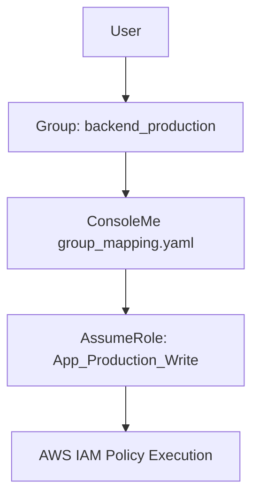

# AWS ConsoleMe

Netflix가 개발한 IAM 접근 관리 도구 ConsoleMe의 역할과 권한 매핑 구조를 정리한 문서입니다.

## ConsoleMe의 역할

* Netflix가 만든 IAM 접근 관리 도구로, 내부 SSO 그룹과 AWS IAM Role을 연결하여 중앙 집중식 접근 제어를 수행합니다.
* 사용자는 ConsoleMe를 통해 IAM Role을 요청하고 승인받아 `AssumeRole`을 수행할 수 있습니다.

## group_mapping 구조

* YAML 설정 파일에서 그룹 이름을 키로, 해당 그룹이 접근 가능한 IAM Role ARN 목록을 정의합니다.
* 각 Role은 `Write`, `Deploy`, `Read` 등 권한 수준에 따라 구분되어 관리될 수 있습니다.

```yaml
group_mapping:
  backend_production:
    roles:
      - arn:aws:iam::[ACCOUNT_ID]:role/App_Production_Write
      - arn:aws:iam::[ACCOUNT_ID]:role/App_Production_Deploy
      - arn:aws:iam::[ACCOUNT_ID]:role/App_Production_Read
```

## 권한 승인 흐름



* ConsoleMe는 내부 그룹 정보를 기반으로 Role을 자동으로 매핑하며, 사용자는 이를 통해 특정 IAM Role을 `Assume`할 수 있습니다.
