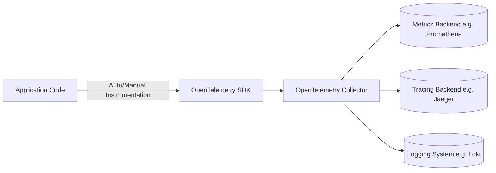

# OpenTelemetry

분산 시스템의 메트릭, 로그, 트레이스를 하나의 표준으로 통합하기 위한 Observability 프레임워크인 OpenTelemetry의 목적과 구조를 정리한 문서입니다.

## 등장 배경과 목표

*   과거에는 메트릭(Prometheus, OpenCensus), 로그, 트레이스(OpenTracing)가 각기 다른 포맷과 SDK로 분리되어 운영의 복잡성이 높았습니다.
*   OpenTelemetry는 기존의 **OpenTracing**(트레이싱 표준)과 **OpenCensus**(메트릭 표준)를 통합하여 단일 Observability 표준을 제공하는 것을 목표로 탄생했습니다.

> **핵심 목표**: "분산 시스템의 메트릭, 로그, 트레이스를 하나의 표준 언어로 통합한다."

## 주요 구성 요소

| 구성 요소 | 역할 |
| :--- | :--- |
| **SDK / Instrumentation** | 애플리케이션 코드 내에서 자동으로 트레이스, 메트릭, 로그 데이터를 수집합니다. |
| **Collector** | 다양한 소스로부터 원격 측정 데이터를 수신, 처리, 내보내는 프록시입니다. |
| **Exporter** | 수집된 데이터를 Datadog, Prometheus, Jaeger 등 다양한 분석 백엔드로 전달합니다. |

## 동작 구조



*   애플리케이션에 OTel SDK를 설치하면, HTTP 요청, DB 쿼리 등의 컨텍스트가 자동으로 계측(instrumentation)되어 데이터가 수집됩니다.
*   Collector는 이 데이터를 받아 표준 포맷으로 변환 후, 설정된 Exporter를 통해 최종 목적지로 전송합니다.

## 개발자 관점의 활용 예시 (Spring Boot)

Java 애플리케이션 실행 시 `javaagent`를 추가하는 것만으로 코드 수정 없이 자동 계측이 가능합니다.

```bash
java -javaagent:opentelemetry-javaagent.jar \
     -Dotel.service.name=my-order-service \
     -Dotel.exporter.otlp.endpoint=http://otel-collector:4317 \
     -jar my-app.jar
```

*   위 설정만으로 서비스의 HTTP, DB, Kafka 호출까지 자동으로 추적할 수 있습니다.
*   특정 APM 벤더에 대한 종속성을 제거하고, 필요에 따라 백엔드 시스템을 유연하게 교체할 수 있는 장점이 있습니다.

```
